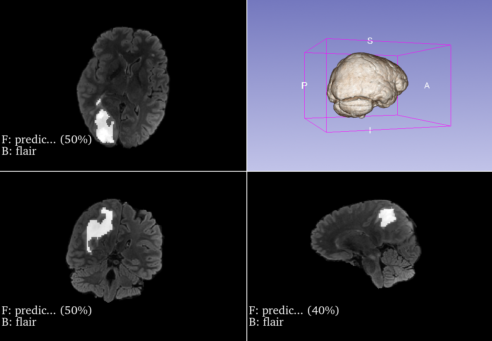

# Clinical Segmentation of BraTS21
An end-to-end Multimodal Brain Tumor Segmentation from Model Training to Clinical Integration

This project implements a full-stack medical AI workflow that bridges deep learning research with clinical imaging infrastructure. It includes training a multimodal U-Net on the BraTS 2021 dataset and deploying an automated inference pipeline integrated with a PACS server.

The system simulates a real-world clinical environment by managing the complete medical imaging lifecycle from local data storage in Orthanc to automated inference and 3D validation in 3D Slicer.

### Key Technical Components

- **Deep Learning:** Multimodal U-Net architecture implemented using MONAI and PyTorch  
- **Clinical Integration:** Automated REST API interaction with an Orthanc PACS server  
- **Coordinate Synchronization:** Affine matrix mapping to ensure zero-shift anatomical alignment between AI masks and original DICOM scans  

---

### Sample Clinical Output



---

## Repository Structure

The repository separates experimental development from production-ready implementation.

`segmentation_pipeline.py`
Primary production script. Automates patient discovery, modality mapping, inference, and export in a single execution.

`development_steps/`
Modular breakdown of pipeline logic for debugging and step-by-step validation.

* `step1_check_orthanc_connec.py` – Verifies PACS server connectivity
* `step2_find_patient.py` – Locates Study UUIDs using Clinical Patient IDs
* `step3_get_patient_info.py` – Retrieves patient-level metadata
* `step4_find_modalities.py` – Automatically maps FLAIR, T1, and T2 sequences across studies
* `step5_run_model.py` – Handles DICOM transcoding, inference, and coordinate-aligned export

`model_training.ipynb`
Contains the full training workflow including data augmentation, loss function design, and hyperparameter tuning.

`models/`
Stores trained model weights (e.g., `unet_brats_multimodal_epoch_50.pth`).

`data/`
Local staging directory for temporary DICOM and NIfTI processing.

---

## Setup and Environment

### 1. Orthanc PACS Installation

The pipeline requires a local Orthanc instance to simulate clinical storage infrastructure.

* Install Orthanc Server
* Ensure it runs on port `8042`
* Configure credentials as `orthanc/orthanc`

### 2. 3D Slicer Integration

3D Slicer is used for data preparation and validation.

Transcoding: 
Use Slicer’s DICOM module to convert original `.nii.gz` volumes into DICOM format.

Upload: 
Upload converted DICOM series to the local Orthanc instance.

Verification: 
Load `prediction_mask.nii.gz` in Slicer alongside the source scans to verify anatomical alignment and view predicted tumor.

### 3. Python Requirements

Install dependencies for medical imaging and deep learning:

```bash
pip install -r requirements.txt
```

---

## Usage

### Automated Pipeline

Run the complete workflow:

```bash
python segmentation_pipeline.py
```

This executes patient discovery, DICOM retrieval, modality mapping, inference, and coordinate-aligned export.

### Manual Testing

For step-wise validation, run individual scripts inside `development_steps/`. Each module operates independently and allows granular verification of PACS queries, metadata extraction, or model execution.

---

## Author

Anvita Manne

---

## Acknowledgement

Data used in this project were obtained as part of the RSNA-ASNR-MICCAI Brain Tumor Segmentation (BraTS) Challenge project through Synapse ID (syn25829067).

If this work is used in academic research, please cite the following publications:

[1] U. Baid et al.,
The RSNA-ASNR-MICCAI BraTS 2021 Benchmark on Brain Tumor Segmentation and Radiogenomic Classification, arXiv:2107.02314, 2021.

[2] B. H. Menze et al.,
The Multimodal Brain Tumor Image Segmentation Benchmark (BRATS), IEEE Transactions on Medical Imaging, 34(10), 1993–2024 (2015).
DOI: 10.1109/TMI.2014.2377694

[3] S. Bakas et al.,
Advancing The Cancer Genome Atlas glioma MRI collections with expert segmentation labels and radiomic features, Nature Scientific Data, 4:170117 (2017).
DOI: 10.1038/sdata.2017.117

If permitted by the publishing venue, please also cite:

[4] S. Bakas et al.,
Segmentation Labels and Radiomic Features for the Pre-operative Scans of the TCGA-GBM collection, The Cancer Imaging Archive, 2017.
DOI: 10.7937/K9/TCIA.2017.KLXWJJ1Q

[5] S. Bakas et al.,
Segmentation Labels and Radiomic Features for the Pre-operative Scans of the TCGA-LGG collection, The Cancer Imaging Archive, 2017.
DOI: 10.7937/K9/TCIA.2017.GJQ7R0EF
